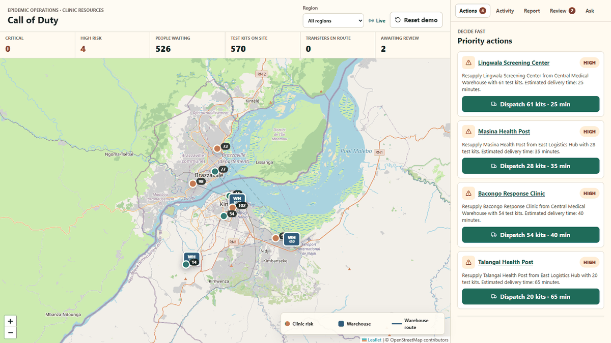
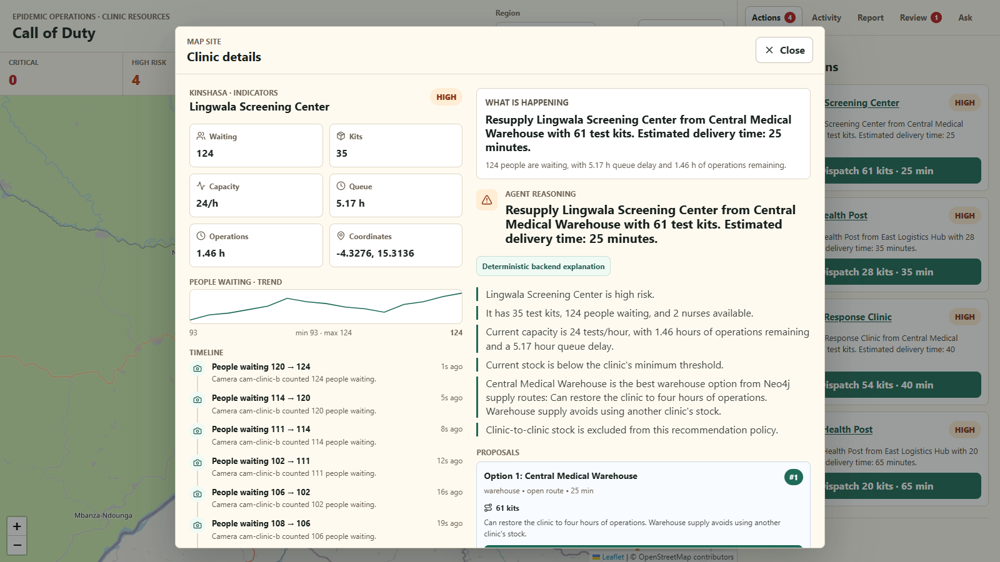
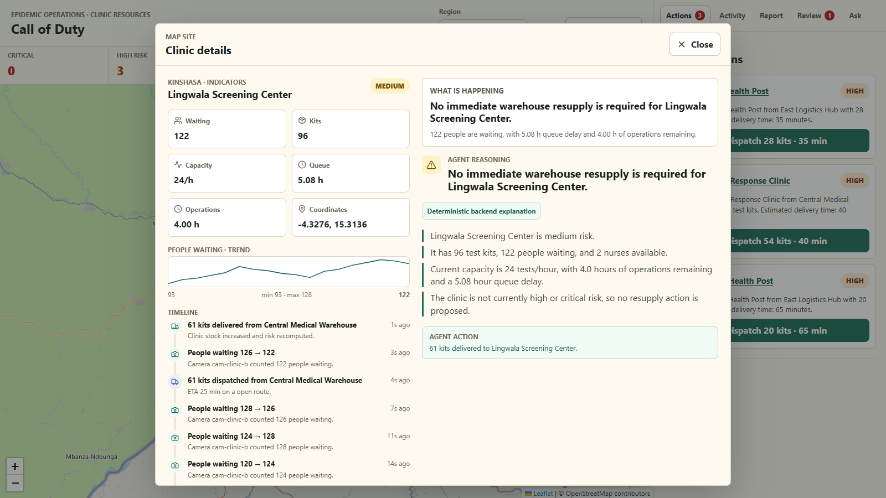
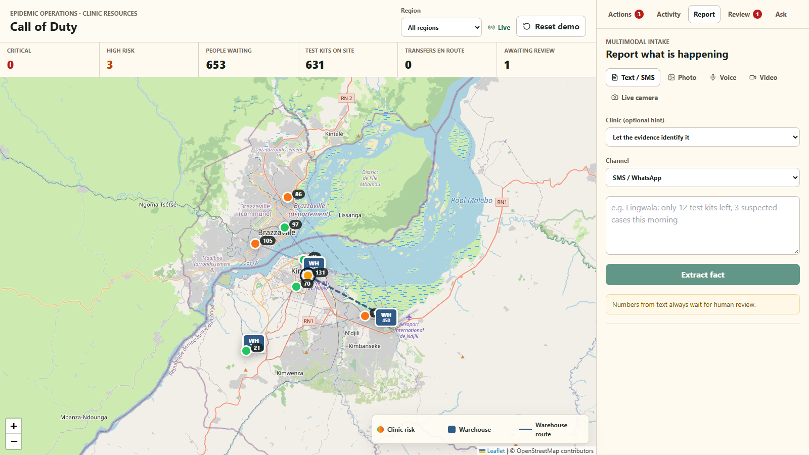
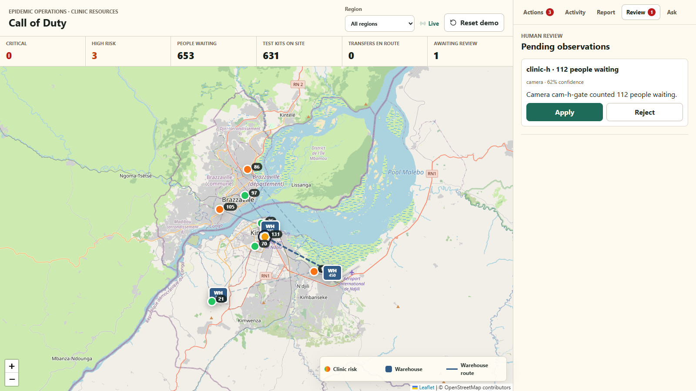
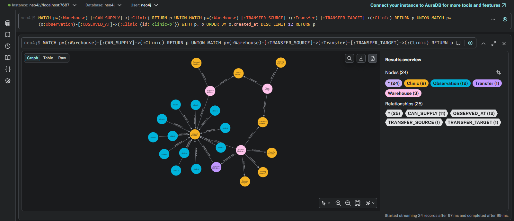
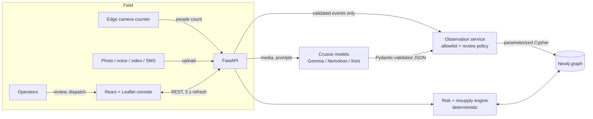

# Call of Duty: Epidemic Clinic Operations

**A centralized map that shows governments and response organizations (WHO, UN
agencies, ministries of health) what is happening in every clinic during an
epidemic, and what to do about it.**

In regions where resources are scarce, there is often no central system to track
clinics. Queue lengths, test-kit stock, and staffing live in phone calls, WhatsApp
messages, and photos, so shortages are noticed after they happen. Call of Duty turns
that stream of messy, multimodal field information into one live, audited picture,
and proposes the next logistics action.



> Demo scenario: an Ebola response with 8 clinics across Kinshasa (DRC) and
> Brazzaville (Congo), 3 supply warehouses, and camera-fed queue counts.

## What it does

### One live operations map
Every clinic is colored by risk and labelled with its live queue. The headline
numbers (critical and high-risk clinics, people waiting, test kits on site, transfers
en route, reports awaiting review) are filtered by region and refresh every 5 seconds.


### Decide fast: ranked priority actions
The backend ranks clinics by urgency and computes a resupply plan for each: which
warehouse, how many kits, and the delivery time by road. One click dispatches it.
Marking the delivery restocks the clinic and recomputes its risk, which closes the loop.

### A timeline for every clinic
Every change is recorded as an observation, whatever its source: a camera count, a
voice note, an SMS, or a manual edit. The history shows who or what reported it,
the before and after values, and the queue trend.

| Clinic timeline and recommendation | After delivery: stock restored, risk down |
|---|---|
|  |  |

### Multimodal intake: information arrives however it can
| Channel | How it becomes data |
|---|---|
| **Cameras** | An edge counter or browser camera posts people counts continuously |
| **Photos** | A vision model (Gemma) extracts one fact, such as a queue or a stock board |
| **Voice notes, recorded calls** | Nemotron Omni transcribes and extracts the fact |
| **Video** | 6 frames are sampled into a contact sheet for the vision model |
| **SMS, WhatsApp, call transcripts** | A text model extracts the fact; the text is treated as untrusted |
| **Operators** | Manual edits are audited like any other source |

| Report what is happening | Human review of uncertain facts |
|---|---|
|  |  |

### Ask in plain language
"Which clinics run out of kits first?" Answers (from Kimi K2.6) are grounded in a
snapshot of live graph data, cite only real clinics, and suggest checks. A situation
briefing can be generated and read aloud.

### The operational graph
Clinics, warehouses, supply routes, transfers, and every observation live in one
Neo4j graph. Each fact is traceable to its source.



## Architecture



## Technical choices

| Decision | Why |
|---|---|
| **Models extract facts; code decides.** Risk, resupply ranking, and transfers are computed by fixed rules in Python, never by an LLM. | Decisions stay explainable and reproducible, and a model mistake cannot move stock. |
| **Every model output is Pydantic-validated** against a closed set of event types. Models never see database credentials or write Cypher. | Model output and uploaded media are untrusted input. The only way to change the graph is through backend-owned, parameterized queries. |
| **Confidence gate plus human review.** Facts at or above 0.90 confidence apply automatically; the rest wait for review. Numbers from text or video *always* wait. | SMS is unauthenticated and sampled video is ambiguous. A self-reported model confidence is not enough to change a stock count. |
| **One observation pipeline for every source.** Camera, AI, and manual edits all become `Observation` nodes. | This gives one audit trail and one timeline. Adding a channel means adding an extractor, not a new write path. |
| **Neo4j** for the operational graph | Supply routes, transfers, and evidence links are relationships, and Neo4j Browser gives field teams an inspectable view.|
| **Python 3.13 + FastAPI** | The AI and vision ecosystem (OpenCV, Pillow, ONNX, the model SDKs) is Python-first. Pydantic doubles as the safety boundary. |
| **React + TypeScript + Leaflet** | A typed, conventional operations console with OpenStreetMap tiles, which work well in the regions served. |
| **Crusoe-hosted open models, one per task**: Gemma 4 for vision and text, Nemotron Omni for audio, Kimi K2.6 for synthesis | Task-specific routing with thinking disabled for structured output. Model IDs are configuration, not code. |
| **Edge people counting** (OpenCV HOG baseline) that posts counts, not images | Counting at the camera saves bandwidth and paid inference, and it keeps images of patients on site. |
| **Polling every 5 s** instead of websockets | The simplest thing that is live enough for an operations room. Server-sent events are the upgrade path. |


## Repository layout

```text
backend/app/api/             FastAPI routers
backend/app/services/        deterministic policy: risk, resupply, transfers, observations, timeline
backend/app/repositories/    parameterized Cypher access
backend/app/inference/       model agents, prompts, media validation, model routing
backend/app/infrastructure/  Crusoe and Neo4j clients
backend/app/schemas/         Pydantic contracts
backend/scripts/             camera counter, simulator, diagnostics, graph init
backend/tests/               unit, contract, integration (Neo4j), live (Crusoe)
frontend/src/                React console
media/                       screenshots and demo GIF
```
